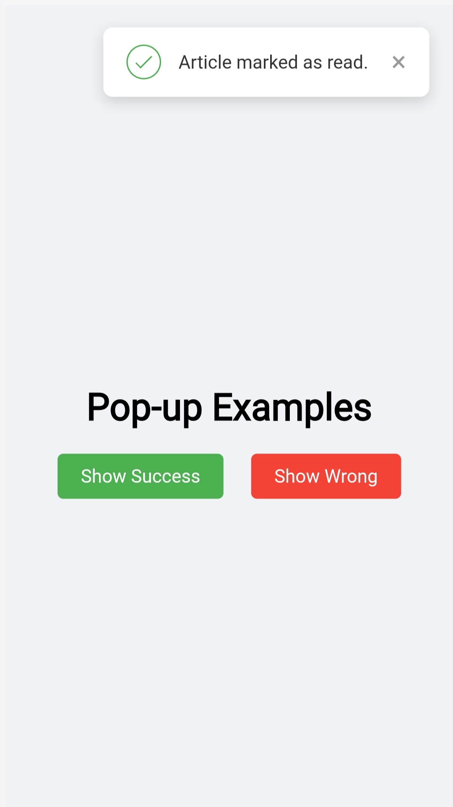
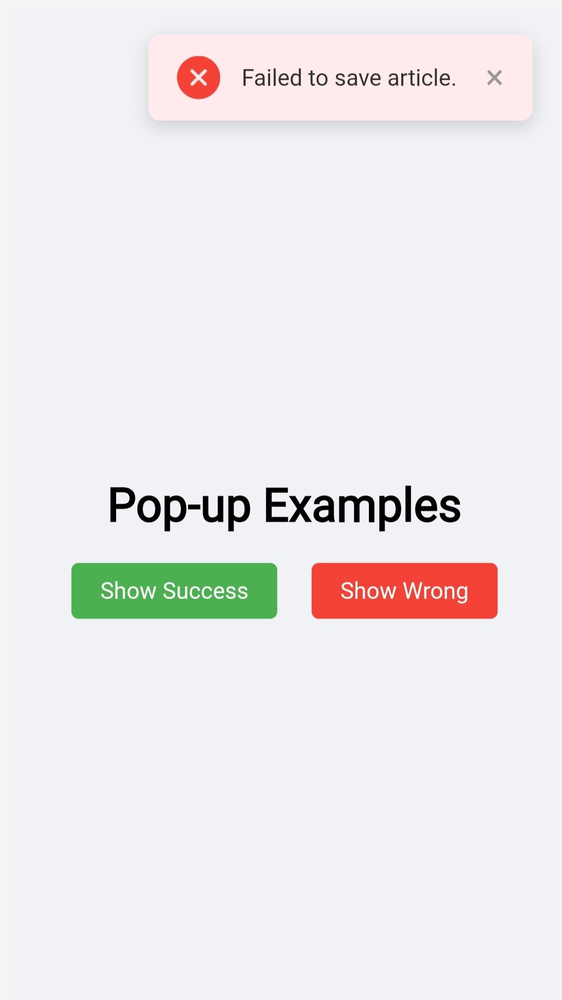

# Popup Display

## 📸 Screenshots

### 1. Success Message Pop-up

*This pop-up appears when an action is successful, such as marking an article as read.*

### 2. Wrong/Error Message Pop-up

*This pop-up is used to inform the user about an error or a failed action.*

## ✨ Features

-   **[Success 1]**: [Briefly explain what this feature does.]
-   **[Failed 2]**: [Describe another key feature.]
-   **[Feature 3]**: [Add more features as needed.]
